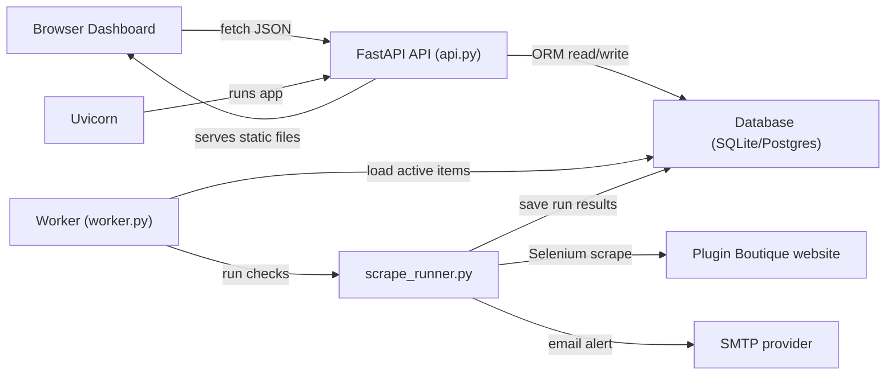
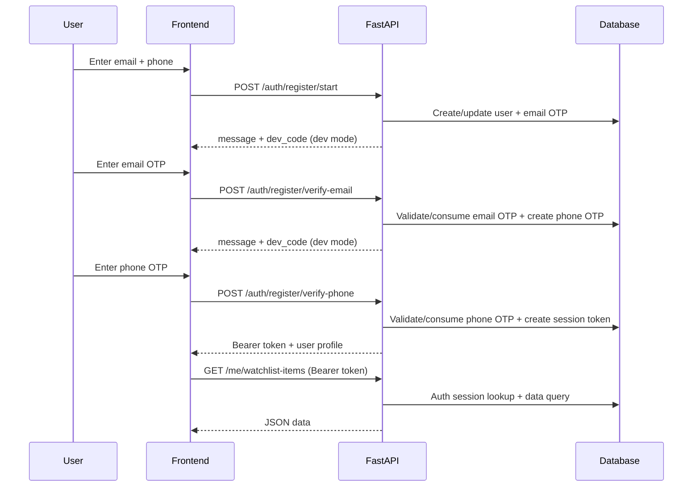

# Beginner's Guide: How This Whole App Works

This guide is for first-time builders.

Goal: help you understand what each part does, how data flows, and how to run/test safely in local development.

## 1. The big idea

Your project is now a **small full-stack system**:

1. API server (`plugin-boutique-api`)
2. Worker process (`plugin-boutique-worker`)
3. Frontend dashboard (browser page served by API)
4. Database (SQLite locally by default)
5. Existing scraper + email alert logic

You can think of it like this:
- API handles requests from browser/mobile.
- Worker does background scraping.
- DB stores state/history/auth.
- Frontend displays and edits data.

## 2. Main technologies and theory

### FastAPI
FastAPI is a Python web framework for building HTTP APIs.

Key concepts:
- Route: URL + HTTP method -> function (`GET /me`, `POST /auth/login/start`, etc.).
- Schema: shape of request/response data (Pydantic models).
- Dependency injection: reusable logic injected into routes (DB session, current user auth).

### Uvicorn
Uvicorn is the **ASGI server** that runs your FastAPI app.

FastAPI defines behavior; Uvicorn provides the running network server on `http://localhost:8000`.

### SQLAlchemy
SQLAlchemy maps Python classes to DB tables:
- `User`
- `WatchlistItem`
- `PriceCheckRun`
- `AuthCode`
- `AuthSession`
- `OtpAttempt`

### 2FA + email verification theory
You use OTP (one-time passcodes):

1. Verify email ownership (email OTP).
2. Verify phone possession (SMS OTP) for second factor.

Only after both checks do you issue a session token (Bearer token).

### Worker theory
The worker is background processing:
- fetch active watchlist items
- scrape pages
- compare thresholds
- send alerts
- save run history

This keeps slow scraping out of API request threads.

## 3. File map (where logic lives)

- API routes: `/Users/johnjoseph/PycharmProjects/plugin_boutique_price_checker/src/plugin_boutique_price_checker/web/api.py`
- Auth helpers/rate limiting: `/Users/johnjoseph/PycharmProjects/plugin_boutique_price_checker/src/plugin_boutique_price_checker/web/auth.py`
- DB setup: `/Users/johnjoseph/PycharmProjects/plugin_boutique_price_checker/src/plugin_boutique_price_checker/web/database.py`
- DB models: `/Users/johnjoseph/PycharmProjects/plugin_boutique_price_checker/src/plugin_boutique_price_checker/web/orm_models.py`
- API schemas: `/Users/johnjoseph/PycharmProjects/plugin_boutique_price_checker/src/plugin_boutique_price_checker/web/schemas.py`
- Worker loop: `/Users/johnjoseph/PycharmProjects/plugin_boutique_price_checker/src/plugin_boutique_price_checker/web/worker.py`
- Shared scrape run path: `/Users/johnjoseph/PycharmProjects/plugin_boutique_price_checker/src/plugin_boutique_price_checker/web/scrape_runner.py`
- Frontend JS: `/Users/johnjoseph/PycharmProjects/plugin_boutique_price_checker/src/plugin_boutique_price_checker/web/static/app.js`

## 4. Architecture flow diagram



## 5. Auth + 2FA flow diagram



## 6. Brute-force protection (OTP)

OTP verify endpoints now enforce limits per:
- email
- purpose (`email_verify`, `phone_verify`, `login_2fa`)
- source IP

Settings:
- `AUTH_OTP_MAX_ATTEMPTS` (default `5`)
- `AUTH_OTP_WINDOW_MINUTES` (default `15`)
- `AUTH_OTP_BLOCK_MINUTES` (default `30`)

Behavior:
- too many invalid codes -> temporary block (`429 Too Many Requests`)
- successful verify clears failure counter

## 7. Dev mode vs production mode

### Dev mode (recommended locally)
- `AUTH_DEV_MODE=true`
- OTP codes returned by API and shown in dashboard (for testing)
- No real SMS provider needed

### Production mode
- `AUTH_DEV_MODE=false`
- Email OTP requires SMTP config
- Phone OTP uses Twilio REST API (`TWILIO_ACCOUNT_SID`, `TWILIO_AUTH_TOKEN`, plus `TWILIO_FROM_NUMBER` or `TWILIO_MESSAGING_SERVICE_SID`)

## 8. How frontend gets backend data

Frontend (`app.js`) calls API with `fetch()`:

- Auth routes for registration/login
- Stores `access_token` in `localStorage`
- Sends `Authorization: Bearer <token>` on `/me/*` requests
- Renders returned JSON into HTML

## 9. Step-by-step local run checklist

1. Install deps
```bash
uv sync
```

2. Set env vars (example `.env`)
```env
DATABASE_URL=sqlite:///./plugin_boutique.db
AUTH_DEV_MODE=true
WORKER_SLEEP_SECONDS=300
AUTH_OTP_MAX_ATTEMPTS=5
AUTH_OTP_WINDOW_MINUTES=15
AUTH_OTP_BLOCK_MINUTES=30
EMAIL_ADDRESS=your_email@gmail.com
EMAIL_PASSWORD=your_app_password
SMTP_ADDRESS=smtp.gmail.com
TWILIO_ACCOUNT_SID=ACxxxxxxxxxxxxxxxxxxxxxxxxxxxxxxxx
TWILIO_AUTH_TOKEN=your_twilio_auth_token
TWILIO_FROM_NUMBER=+15551234567
```

3. Start API
```bash
uv run plugin-boutique-api
```

4. Start worker (new terminal)
```bash
uv run plugin-boutique-worker
```

5. Open UI
```text
http://localhost:8000/
```

## 10. Test strategy now included

There are now integration tests for:
- full auth registration/login flow
- protected `/me/*` endpoints
- OTP brute-force lockout behavior

Test file:
- `/Users/johnjoseph/PycharmProjects/plugin_boutique_price_checker/tests/test_api_auth_integration.py`

Run:
```bash
uv run python -m pytest -q
```

## 11. What to build next (learning roadmap)

1. Move from `create_all` compatibility to Alembic migrations.
2. Add auth logout/revocation endpoint.
3. Add passwordless magic-link email option (optional UX improvement).
4. Add API-level rate limits at reverse proxy/load balancer too.
